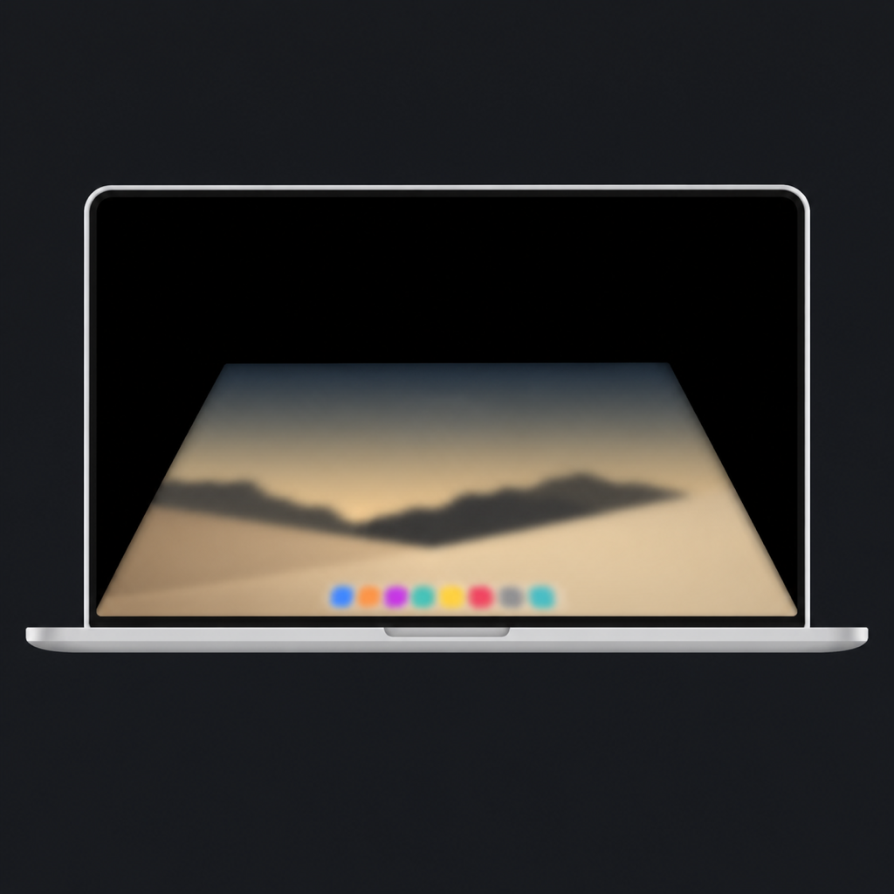
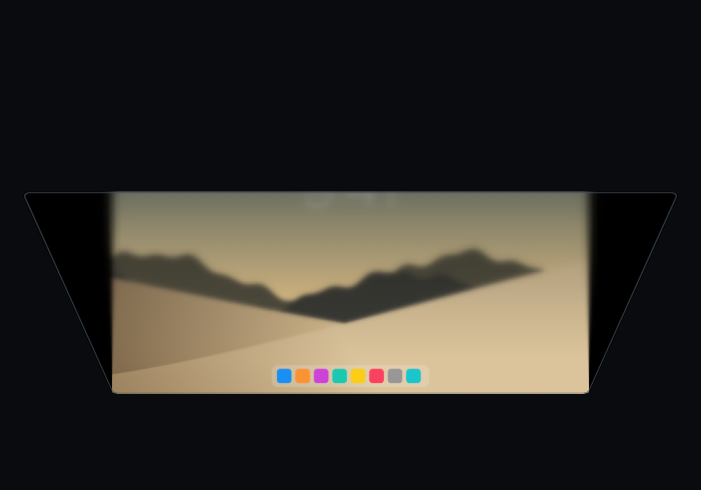

# Duo Lid



**Your desktop stays. Your lid moves.**

Created by **Michal Stawarz @ [appbeat.pl](https://appbeat.pl)**, 2026 · [LinkedIn](https://pl.linkedin.com/in/michal-stawarz-86726830)

Duo Lid is an experimental native macOS app inspired by **iPhone DUO's folding animation**. As you lower your MacBook's lid, a frozen desktop appears to stay on a stationary reference plane while the lid moves around it. The overlay compensates for the physical panel's rotation using the same geometry as the window preview. The lid occludes content, with black space outside the snapshot. Blur and darkness spread toward the hinge as the lid closes.

The effect follows **lid position, not elapsed time**. Stop closing and it holds. Start reopening and the same animation reverses.



[Download the prototype ZIP](https://github.com/StarWars/iphone-duo-closing-animation-on-macbook/raw/refs/heads/main/downloads/Duo-Lid-Prototype.zip) · [QA report](duo-animation/qa/REPORT.md) · [Attributions](ATTRIBUTIONS.md) · [NOTICE](NOTICE)

[Watch a sample fold](duo-animation/qa/current/sample-fold.mp4) · [Very slow sample fold](duo-animation/qa/current/sample-slow-fold.mp4)

## Requirements and current status

- macOS 14 or newer and a Metal-capable Mac.
- App bundle identifier: `pl.appbeat.DuoLid`.
- Current prototype: **0.7.2, build 13**.
- Physical lid tracking requires a MacBook with a readable matching lid-angle sensor. Compatibility is detected at runtime; not every MacBook model is supported.
- The manual sample preview works without a sensor, including on desktop Macs.
- The prototype binary includes Apple Silicon and Intel architectures. Only Apple Silicon execution has been tested.

The app includes stationary-plane desktop compensation, a moving-lid preview, an adjustable trigger, adaptive smoothing, menu-bar operation and optional launch at login. It has a custom MacBook icon, creator About popup and LinkedIn button. Desktop/sample selections refresh the preview at its current angle, and visible Duo Lid windows can appear in desktop captures.

The 0.7.2 universal build, all 32 XCTest tests, sample-only GPU checks, signature, packaged resources and checksum passed verification on an M1 Pro. The source is suitable to share as an experimental open-source prototype. Live header/About/link interactions, permissioned desktop capture, physical compensation, login/wake behavior and global shortcut delivery still need hands-on validation. See the [QA report](duo-animation/qa/REPORT.md) for exact coverage. This remains an ad-hoc-signed prototype, not a notarized production release.

## Install the app

### Prebuilt prototype

1. Download [Duo-Lid-Prototype.zip](https://github.com/StarWars/iphone-duo-closing-animation-on-macbook/raw/refs/heads/main/downloads/Duo-Lid-Prototype.zip), or find it in this repository's `downloads/` folder.
2. Extract the ZIP and move **Duo Lid.app** to your **Applications** folder. There is no installer or helper service.
3. Open **Duo Lid.app**. The first launch shows a generated sample desktop with the sensor disconnected and the desktop effect off. No privacy permission is requested at launch. Later launches run quietly in the menu bar and remember whether you enabled the effect.

To update, quit Duo Lid and replace the existing app with the extracted copy. Editing or pulling this repository does not update an installed app.

The binary is **ad-hoc signed with hardened runtime, but not Developer ID-signed or Apple-notarized**. Gatekeeper may block a downloaded copy because Apple cannot verify its publisher. Building the source locally is an alternative. If you trust this source and deliberately choose to open the downloaded prototype, follow [Apple's per-app approval instructions](https://support.apple.com/en-us/102445). Do not disable Gatekeeper, remove quarantine attributes, or ignore a malware/damaged-app warning.

An archive-integrity checksum is provided in [downloads/SHA256SUMS](downloads/SHA256SUMS). From the `downloads/` folder, run `shasum -a 256 -c SHA256SUMS`. A matching checksum checks file integrity; it is not Apple notarization or an independent security audit.

### Build from source

Install Xcode with Swift 6.2 or later and a macOS SDK, then:

```sh
git clone https://github.com/StarWars/iphone-duo-closing-animation-on-macbook.git
cd iphone-duo-closing-animation-on-macbook
```

Open **`duo-animation/DuoLid.xcodeproj`** in Xcode, select the **DuoLid** scheme and **My Mac**, and Run. No third-party runtime packages need to be installed. To make your own installable app, build the Release configuration, locate **Products → DuoLid.app → Show in Finder**, and copy that app to Applications.

The Xcode project is checked in. XcodeGen is optional and needed only when regenerating it from `duo-animation/project.yml`. The shader compiles once through the system Metal driver; the optional standalone Xcode Metal Toolchain is not required.

## Use Duo Lid

### 1. Explore without permissions

Click **Play a fold**, or drag **Lid position**. Stop midway, then drag back to see the reversal. Adjust **Depth**, **Softness**, and **Shade** to tune the appearance. The sample image is generated locally and is not a screenshot of your desktop.

The preview shows the panel folding around stationary desktop content. **Use sample image** returns to the generated desktop and redraws at the current lid position without requiring another slider change. **Preview my desktop** replaces it with a temporary capture as soon as that capture is ready; it also redraws without moving the slider. Both source-selection actions pause the real desktop effect.

### 2. Check your MacBook's sensor

Keep the MacBook awake, unlocked, and comfortably open. Click **Connect lid sensor**, then move the lid slowly. If the sensor is readable, the preview follows its position. No Screen Recording permission is needed for this step.

If the app reports no readable sensor, the desktop effect remains disabled and the manual preview stays available. Do not grant unrelated permissions or run the app as administrator to try to make unsupported hardware work.

Physically test **Control–Option–Command–D (`⌃⌥⌘D`)** and check for the **Paused** status before proceeding. Also check it while another app is focused. Desktop mode cannot be enabled if shortcut registration fails; automated keypress delivery has not verified the global shortcut.

### 3. Enable the desktop effect

Use the MacBook's built-in, unmirrored display. Select **Enable desktop lid effect**. Only now does the app request **Screen Recording** access so it can obtain an image of that display.

Grant access in **System Settings → Privacy & Security → the screen-recording section**. Relaunch if macOS requires it, then enable the effect again if it is off. **Preview my desktop** is another optional action that requests the same permission and puts one temporary snapshot in the preview window.

Captures include normal visible Duo Lid windows, including Settings and preview. Only the effect overlay is excluded to avoid capturing an earlier overlay into the next image. Open the desired window before entering the prewarm approach range: changes made after that snapshot is taken will not appear during the current gesture.

Set **Trigger angle** in **Settings and preview…**. The default is **90°**; enter a whole-degree value from **30° to 140°**, press Return or leave the field, or use the arrows to adjust by one degree. **Reset** restores 90°. The value is saved across launches. Choose an angle your MacBook can physically reach. Changing it clears the current gesture and any pending capture; if enabled, the effect waits until the lid opens to the new trigger before rearming.

Lower the lid **below the selected trigger angle**. At or above that angle, the overlay is hidden. The trigger uses the sensor's raw angle: there is no learned starting posture or extra activation travel. The physical overlay counteracts the lid's rotation so the screenshot appears stationary, matching the preview's fixed reference plane. Parts of the desktop become occluded as the lid closes; the screenshot is not resized to keep every corner visible. The bottom edge remains anchored at the hinge. **Depth** adjusts rotation compensation; zero disables it. Blur and darkness progress across the trigger-to-closure interval, with content black by approximately 10°. Projection uses actual angular travel from the selected trigger rather than rescaling that travel with the fade interval.

While desktop mode is enabled, the app prewarms **one temporary snapshot** within the ten-degree approach band above the trigger (90–100° by default), then keeps it through holds and partial reversals. This avoids waiting for capture and blur preparation at the crossing; it is not continuous recording. If the lid skips that approach range or capture is still pending, the overlay waits for the snapshot rather than showing invalid content. The sensor reports whole degrees, so the physical threshold and timing remain limited by sensor accuracy and sampling.

### Keep it available from the menu bar

Close the preview window after enabling the effect. Duo Lid stays in the menu bar without a Dock icon. Its MacBook menu offers **Settings and preview…**, enable/disable, **Pause desktop effect**, **Launch at login**, **About Duo Lid…** and **Quit Duo Lid**.

**About Duo Lid…** displays the custom icon, version and creator credit for Michal Stawarz, 2026, with a LinkedIn feedback link. The blue LinkedIn icon beside the preview headline opens the same profile. Website/profile links open in your browser when selected.

Select **Launch at login** in that menu to start Duo Lid automatically when you sign in. The app must be in Applications first. If macOS requires approval, the menu exposes **Approve login item in System Settings…**; the checkmark reflects the system's actual registration status. This uses Apple's [main-app login-item API](https://developer.apple.com/documentation/servicemanagement/smappservice/mainapp), without a separate helper or daemon. Deselect it to stop automatic launches.

The app remembers your enabled choice, trigger angle, and Depth, Softness, and Shade settings. When enabled, it reconnects after launch, sleep, unlock, or a display/session change. It waits for an active session, existing Screen Recording permission, a working pause shortcut, the built-in display, and a fresh sensor reading **at or above your trigger** before rearming. Automatic restoration never requests a new privacy permission. Closing the lid still allows normal macOS sleep.

### Pause and exit

- **Click anywhere on the overlay** to pause. The click is consumed, not forwarded to an app underneath.
- Use **`⌃⌥⌘D`**, the preview's **Pause** button, or **Pause desktop effect** in the menu bar.
- These manual pause routes turn the effect off until you explicitly enable it again, including across wake and relaunch.
- Reopening to **your trigger angle** removes the overlay; a continuous gesture is capped at **30 seconds** and waits for reopening to that angle before rearming.
- **Quit Duo Lid** removes the overlay and releases the app's sensor resources.

While the overlay is visible, mouse interaction is deliberately blocked because a shifted screenshot does not match the real controls underneath. Keyboard focus stays with the underlying app, so avoid typing during the effect.

## Permissions — and why there are so few

| Feature | Permission | Why |
| --- | --- | --- |
| Generated sample preview and appearance controls | None | The app draws its own image locally. |
| Lid-angle reading on supported hardware | No additional privacy permission requested by the app | It reads only the matching orientation sensor through IOKit, non-exclusively. It does not monitor keyboard or trackpad input. |
| Your desktop preview or desktop lid effect | Screen Recording | macOS protects desktop pixels. ScreenCaptureKit needs access to obtain the temporary display image. Audio capture is disabled. |

**Screen Recording is the only privacy permission the app requests.** It is optional until you choose a feature that uses your real desktop. Denying it leaves sample mode usable. The app makes its permission request at most once per app session; macOS controls its own permission dialogs and reminders.

The small permission footprint comes from keeping this a local visual effect: direct read-only sensor access, public screen-capture APIs, GPU rendering, an ordinary nonactivating overlay, and a registered pause shortcut. It does not automate other apps, inspect their accessibility trees, record keystrokes, track your eyes, or modify your system.

There is no request for **Accessibility, Input Monitoring, Full Disk Access, camera, microphone, location, or administrator privileges**. No network connection or online account is needed. If an unexpected permission prompt appears, leave it denied.

The build uses hardened runtime with no extra Release entitlements, but **is not App Sandbox-enabled**: the undocumented HID interface's sandbox compatibility has not been validated. Minimal permission requests are not a claim that the prototype is sandboxed or independently security-audited.

## Privacy: no user-information collection

**Duo Lid does not collect personal information, usage analytics, or telemetry. It does not send user information anywhere.** There are no accounts, analytics SDKs, advertising, remote services, uploads, or background network requests in the app.

To draw the effect, it temporarily processes desktop pixels and lid-angle readings **on your Mac only**. This local processing is the reason Screen Recording access is needed; it is not data collection for storage, profiling, or transmission.

- Desktop snapshots and their blurred versions stay in process/GPU memory. The normal app does not save screenshots, record video or audio, extract text, or retain a lid-angle history.
- An approach snapshot can remain in memory while armed within the ten-degree band above the trigger, then is held through the gesture. It is discarded on reopening to the trigger, moving out of that approach band, changing the trigger, pause, or a session change. The app may prewarm a new approach snapshot while armed. A desktop-preview snapshot remains in the preview until replaced, a session transition occurs, or the app quits.
- Sleep/lock and session transitions clear the overlay and replace any desktop-preview image with the generated sample. Capture cancellation and generation checks prevent a delayed frame from reinstating an overlay. If you left the effect enabled, it can rearm with a fresh reading and capture after the session returns and the lid is open.
- The enabled choice, trigger angle, appearance values, first-run setup flag, and normal macOS window-position/size preferences persist locally. Desktop content and sensor history do not. macOS stores the optional login-item registration.
- The explicit developer **`--verify`** mode writes only generated sample/calibration images and performance output. It never captures your desktop or opens the sensor.

You can revoke Screen Recording access in System Settings. To uninstall, deselect **Launch at login** if enabled, quit the app, and move **Duo Lid.app** to the Trash. You can also remove the login item in System Settings. There is no helper service.

## Safety and limitations

The app does not write to the lid sensor, seize it exclusively, actuate the trackpad, change brightness, prevent normal sleep, or manipulate secure lock-screen spaces. It clears the desktop effect on near closure, stale/failed sensor readings, capture loss, display changes, and observed sleep/session transitions. Automatic restoration preserves the user's enabled choice while requiring an open lid and an active session; a manual Pause clears that choice.

The desktop is a **frozen snapshot**, so videos and other changing content appear frozen during a gesture. Content that changes after prewarming will not appear in that snapshot. The projection aims to keep the desktop stationary on the plane at the selected trigger (90° by default), while the lid moves around it. The overlay's pixels intentionally distort to compensate the real panel's movement; viewing those pixels alone as a flat screenshot does not show the intended illusion. The fixed virtual eye is an approximation, not head tracking; your viewing position and the delay between real and presented angles affect stability. Fullscreen/Spaces behavior, capture latency, battery use, and exact hardware support require further testing. The MacBook's one bottom-hinged panel differs from the two-panel phone scene; this is an interpretation, not a pixel-identical recreation.

Version 0.7.2 retains rendering at up to 1600 pixels wide (matching the snapshot) and the progressively downsampled blur pyramid. A critically damped filter presents fractional transitions between whole-degree readings on MetalKit's preferred 60 Hz loop. Its response adapts to the spacing of distinct sensor values: very slow one-degree changes blend over longer transitions, while faster movement keeps the short response. It never predicts beyond a measured angle. This smooths quantization by adding visual delay; after slow motion stops, the remaining transition can take about 2.5 seconds to settle exactly. Raw readings still control activation and immediate removal at the selected trigger. A low trigger compresses the visual effect into less lid travel, so each measured degree changes the effect more. The preview stops animating behind an overlay, and settled holds stop drawing. Sensor reports and frame presentation are processed separately, so resuming after a drawing pause does not snap to the next degree. The [QA report](duo-animation/qa/REPORT.md) includes M1 Pro checks for stationary-plane compensation, one-degree-per-two-second input, custom triggers and background-state safety. Physical compensation, custom triggers, login, wake/unlock and permissioned background restoration still need hands-on validation.

## Project layout and development

```text
README.md                         Installation, usage, permissions, and privacy
ATTRIBUTIONS.md                   Inspiration, references, and tool credits
LICENSE                          Existing Apache-2.0 project license
NOTICE                           Creator copyright and attribution notice
CHANGELOG.md                     Release history
CONTRIBUTING.md                  Bug reports and contribution guidance
downloads/                       Installable prototype ZIP and install notes
duo-animation/
  DuoLid.xcodeproj                Native Xcode project
  project.yml                    Optional XcodeGen specification
  scripts/package.sh             Reproducible universal ZIP and checksum
  App/Artwork/                   Icon master, reference and generation prompt
  App/Assets.xcassets/            macOS app icon sizes
  Sources/                       AppKit, IOKit, ScreenCaptureKit, Metal/MPS
  Tests/                         Gesture, damping, sensor-report, trigger and background tests
  qa/                            Generated visual samples, preview video, QA report
```

See [developer instructions](duo-animation/README.md) for command-line build/test and sample-only GPU verification. Build products, personal research recordings, and generated frame sequences are excluded from Git.

The public QA images, videos and traces are generated from the app's sample desktop and calibration patterns. No personal recordings or real desktop captures are included. See [CHANGELOG.md](CHANGELOG.md) for the development history and [CONTRIBUTING.md](CONTRIBUTING.md) for reporting problems or contributing changes.

## Inspiration and attributions

Inspired by **iPhone DUO's animation** and the user's [current Vercel reference](https://iphone-duo.vercel.app/) from [jal-co/iphone-duo](https://github.com/jal-co/iphone-duo) (MIT). Its anchored content and moving blur/coverage boundary informed version 0.3. [chuspeeism/iphone-duo](https://github.com/chuspeeism/iphone-duo) (MIT) informed the earlier projection and darkening concepts. [samhenrigold/LidAngleSensor](https://github.com/samhenrigold/LidAngleSensor) (Apache-2.0) documented the lid sensor identifiers and report format; Duo Lid uses its own reader rather than incorporating that project.

**No third-party libraries are bundled or linked at runtime.** The app uses Apple system frameworks. Three.js, the sensor reference implementation, and Apple phone artwork are not included. See [ATTRIBUTIONS.md](ATTRIBUTIONS.md) for the distinction between references and optional development tools.

This is an independent project, not an Apple product or an Apple-endorsed application. The repository's existing [Apache-2.0 license](LICENSE) is preserved; referenced projects retain their own licenses. [NOTICE](NOTICE) credits Michal Stawarz @ appbeat.pl, 2026. [End-user terms and risk notice](EULA.md) explain experimental use, warranty disclaimers and liability limits, subject to mandatory legal rights. All three files are included in the app and prototype ZIP; the menu-bar **Licence and risk notice…** action opens the terms. Save your work and keep backups before testing. These terms do not guarantee immunity from claims or replace mandatory consumer protections.
